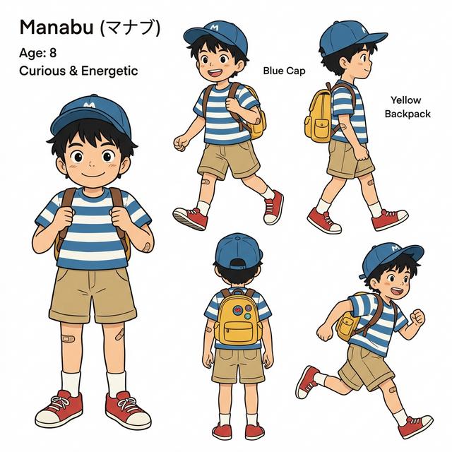
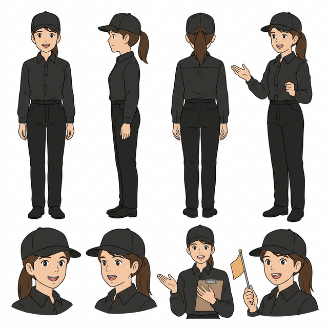
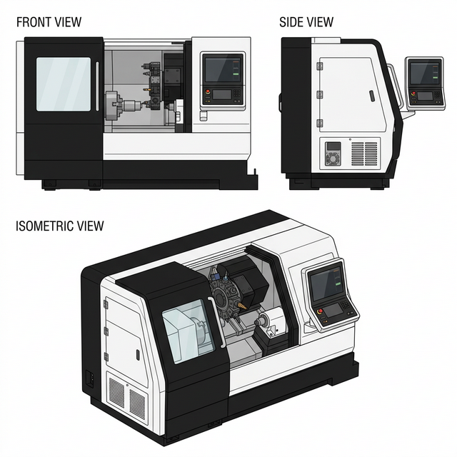
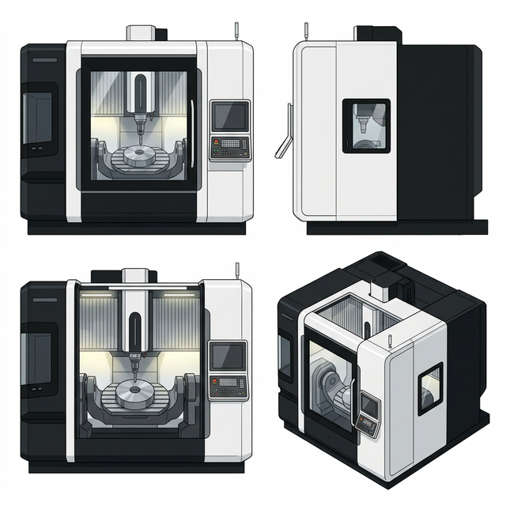

# 絵本プロジェクト デザインガイド (Design Guide)

このフォルダは、絵本に登場するキャラクターおよび工作機械の「公式デザイン設定集（プロンプト・リファレンス）」をまとめて保管する場所です。
一貫したイラストを生成するため、今後の全ページ制作においてこの設定と参照画像を厳守してください。

---

## 🧑‍🔧 キャラクターデザイン集

### 1. まなぶくん (Manabu-kun)
*   **役割:** 絵本の主人公（ものづくりが大好きな男の子）
*   **特徴:** 青いキャップ、水色と白のボーダーTシャツ、カーキの半ズボン、赤いスニーカー、黄色いリュックサック
*   **詳細資料:** [character_design_manabu.md](./character_design_manabu.md)
*   **参照画像:** 

### 2. 工場の案内のおねえさん (Factory Guide Oneesan)
*   **役割:** 工場案内のガイドスタッフ
*   **特徴:** 黒の作業用キャップ、黒のYシャツ（トップス）、黒の作業用ズボン、後ろで一つにまとめた茶髪、親切な笑顔
*   **詳細資料:** [character_design_guide.md](./character_design_guide.md)
*   **参照画像:** 

---

## 🏭 工作機械デザイン集

デザイン全体の方針：**白黒ツートンカラー**、**流線型・モダンで高級感のあるインダストリアルデザイン（DMG MORI・太陽工機ベース）**

### 1. ターニングセンタ (Turning Center)
*   **特徴:** 白黒ツートン、大型のシームレス正面ガラス窓、内部のチャックとタレット
*   **詳細資料:** [machine_design_turning_center.md](./machine_design_turning_center.md)
*   **参照画像:** 

### 2. マシニングセンタ (Machining Center)
*   **特徴:** 白黒ツートン、片開きのスライドガラス正面窓、金属製の側面パネル
*   **詳細資料:** [machine_design_machining_center.md](./machine_design_machining_center.md)
*   **参照画像:** 

### 3. 5軸マシニングセンタ (5-Axis Machining Center)
*   **特徴:** 白黒ツートン、巨大な正面ガラス窓の奥に見えるU字型のゆりかご（トラニオン）テーブル、側面には小窓のみ
*   **詳細資料:** [machine_design_5axis_machining_center.md](./machine_design_5axis_machining_center.md)
*   **参照画像:** 

### 4. 立形研削盤 (Vertical Grinding Machine)
*   **特徴:** 背の高い縦型の筐体、白黒ツートン、正面ドアは大部分が金属で小窓付き、円柱形砥石が横向き
*   **詳細資料:** [machine_design_grinding_machine.md](./machine_design_grinding_machine.md)
*   **参照画像:** 

---

> [!IMPORTANT]
> 画像を生成する際は、該当する \`character_design_*.md\` または \`machine_design_*.md\` に記載されている公式プロンプトをそのまま使用してください。
