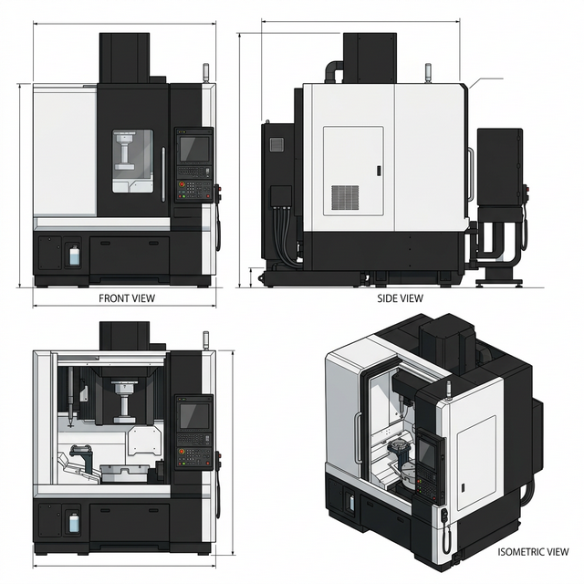

# 研削盤（工作機械） デザイン定義

絵本全体のイラストで「研削盤（Grinding Machine）」の機械デザインを統一するための、画像生成AI向けの設定資料（プロンプト・リファレンス）です。太陽工機の「Vertical Mate 85 2nd Generation」を参考にしています。

## 1. 基本設定（Core Identity）
- **種類:** 立形研削盤 (Vertical Grinding Machine)
- **役割:** 砥石（といし）を高速回転させて表面を少しずつ削り、鏡のように滑らかで超高精度な平面や内径・外径を作り出す「最後の仕上げ」を行う機械
- **テイスト:** リアルで重厚感があるが、清潔で近代的な工場の設備。背が高く非常に高精度で整然とした印象 (highly detailed, realistic, clean modern, ultra-precision, tall vertical)

## 2. 外観の固定要素（Visual Anchors）
一貫性を保つため、以下の構成要素を**すべてのイラストで固定**します。

*   **筐体カラー (Body Color):** 白と黒の2色をベースとしたカラーリング（高級感のあるモダンなツートンカラー） (stark two-tone solid black and pure white body color)
*   **全体デザイン (Overall Design):** 太陽工機（DMG MORIグループ）の「Vertical Mate 85 2nd Generation」などに見られる、背が高く堅牢な縦長ボックス型のプレミアムな次世代インダストリアルデザイン (tall vertical box-like structure, design inspired by modern Taiyo Koki Vertical Mate 85 2nd Gen, ultra-sleek minimalist premium industrial aesthetic)
*   **安全窓・ドア (Safety Window & Door):** 研削液や飛散物を防ぐための、**頑丈な金属製の正面スライドドア**。ドアの中央部分などに、内部の加工部を確認するための**小さなまたは中くらいの透明なガラス窓**がついている（全面ガラス張りではない） (solid metal frontal sliding door with a smaller or medium-sized transparent observation window, NOT fully glass)
*   **側面・外装 (Exterior Panels):** 側面は頑丈な金属製の不透明な外装パネルで覆われていること。ガラス窓や余分なドアは描画しない (solid opaque metal exterior side panels)
*   **操作盤 (Control Panel):** 右側に配置された、大型タッチパネルベースの先進的な操作システム (advanced large touchscreen control panel interface ERGOline X)
*   **【重要】ロータリーテーブル (Rotary Table):** 内部の下部にある、円柱状またはドーナツ状の金属ワークを乗せて回転する丸いテーブル (round rotary table at the bottom holding a circular metal workpiece)
*   **【最重要】主軸・砥石 (Spindle & Grinding Wheel):** 上部から下に向かって伸びる**立形の工具主軸（ツールスピンドル）**を備えている。主軸の先端には**円柱状の研削砥石**が取り付けられており、**砥石の回転軸は主軸（縦方向）に対して垂直（水平方向）になるように配置された円柱形状**の砥石であること (vertical tool spindle descending from above. Attached to the bottom of this spindle is a prominent CYLINDRICAL grinding wheel. The cylindrical grinding wheel is oriented HORIZONTALLY, perpendicular to the vertical spindle's longitudinal direction, matching the Taiyo Koki reference style exactly)

---

## 3. 画像生成AI（参照用画像作成）向けプロンプト
参照用画像（機械のデザインシート）を作成するためのベースプロンプトです。

### 英語プロンプト
> [Industrial machinery concept art, front, top, and isometric views of the same machine], a HIGHLY REALISTIC, DETAILED modern Vertical Grinding Machine inspired by Taiyo Koki Vertical Mate 85 2nd Generation design language. It has a tall vertical box-like structure with an ultra-sleek minimalist premium industrial aesthetic and a stark two-tone solid black and pure white body color. It features solid opaque metal exterior side panels. The front has a SOLID METAL SLIDING DOOR with a smaller transparent observation window (crucially, the front door is NOT fully glass). It has an advanced large touchscreen control panel interface on the right. Inside the illuminated workspace, there is a round rotary table holding a circular metal workpiece. CRITICAL SPECIFICATION based on the provided reference image: There is a prominent VERTICAL TOOL SPINDLE descending from the ceiling. Attached to the bottom of this vertical spindle is a thick CYLINDRICAL GRINDING WHEEL. The cylindrical grinding wheel is oriented HORIZONTALLY (its rotation axis is perpendicular to the vertical spindle's longitudinal direction), acting on the workpiece, EXACTLY like the tool seen in the provided reference image. Anime style flat color but the machine is highly detailed and realistic, bright industrial lighting, machinery design sheet --no text, font, letters, words, messy, dirty

---

## 4. 完成したコンセプトシート（キャラクターシート）

※画像がプレビュー表示されない場合は、以下のリンクをクリックして直接開いてご確認ください。
[研削盤のコンセプトシートを開く](./ref_grinding_machine.png)
