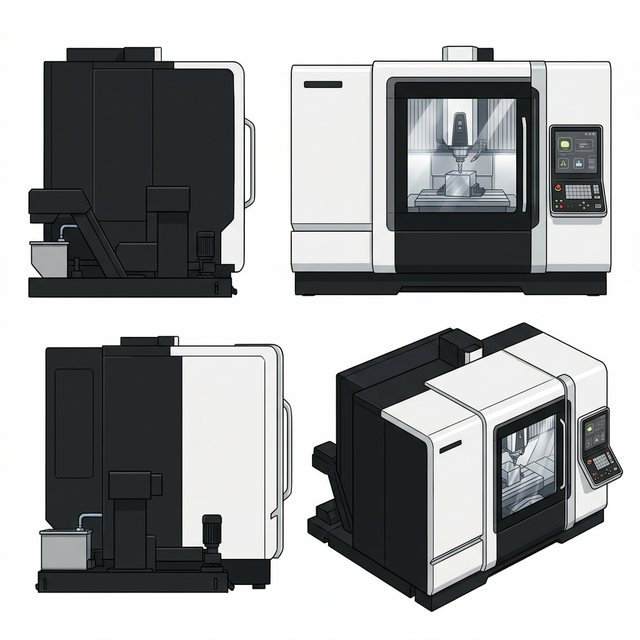

# マシニングセンタ（工作機械） デザイン定義

絵本全体のイラストで「マシニングセンタ（横形マシニングセンタ）」の機械デザインを統一するための、画像生成AI向けの設定資料（プロンプト・リファレンス）です。

## 1. 基本設定（Core Identity）
- **種類:** マシニングセンタ / 横形マシニングセンタ (Machining Center / Horizontal Machining Center)
- **役割:** 四角い金属などを固定し、回転する刃物を当てて複雑な形状に削る機械
- **テイスト:** リアルで重厚感があるが、清潔で近代的な工場の設備 (highly detailed, realistic, clean modern)

## 2. 外観の固定要素（Visual Anchors）
一貫性を保つため、以下の構成要素を**すべてのイラストで固定**します。

*   **筐体カラー (Body Color):** 白と黒の2色をベースとしたカラーリング（高級感のあるモダンなツートンカラー） (stark two-tone solid black and pure white body color)
*   **全体デザイン (Overall Design):** DMG MORI社の「NHX 4000 3rd Generation」などの後継となる最新のフラットデザインを彷彿とさせる、洗練された箱型でプレミアムな次世代インダストリアルデザイン (design inspired by modern DMG MORI Horizontal Machining Center NHX series, ultra-sleek minimalist premium industrial aesthetic)
*   **安全窓・ドア (Safety Window & Door):** 加工部を観察できる、フラットで継ぎ目の少ない大きな透明の安全ガラス窓が付いた、**正面に1つだけの片開きスライドドア** (strictly ONLY ONE single horizontally sliding frontal safety door per machine, do not draw doors on the sides)
*   **側面パネル (Side Panels):** 側面は透明なガラスではなく、頑丈な金属製の不透明な外装パネルで覆われていること (solid opaque metal exterior side panels, no glass on the sides)
*   **操作盤 (Control Panel):** 右側または手前に配置された、大型タッチパネルベースの先進的な操作システム (advanced large touchscreen control panel interface)
*   **主軸・刃物 (Spindle & Tool):** 内部の上部または横から突き出た、高速回転する主軸と、そこに取り付けられたドリルやフライスなどの切削工具 (high-speed rotating spindle holding a milling cutter or drill bit)
*   **テーブル・ワーク (Table & Workpiece):** 内部の下部にある、四角い金属素材（ワーク）をしっかりと固定しているパレットやテーブル (sturdy table or pallet holding a cubic metal workpiece)

---

## 3. 画像生成AI（参照用画像作成）向けプロンプト
参照用画像（機械のデザインシート）を作成するためのベースプロンプトです。

### 英語プロンプト
> [Industrial machinery concept art, front, top, and isometric views of the same machine], a HIGHLY REALISTIC, DETAILED modern Horizontal Machining Center inspired by DMG MORI NHX series design language. It has an ultra-sleek minimalist premium industrial aesthetic with a stark two-tone solid black and pure white body color. It features solid opaque metal exterior side panels (no side windows). CRITICAL: The machine has STRICTLY ONLY ONE SINGLE horizontally sliding frontal safety door with a large flush-mounted seamless safety glass window. Do not duplicate the front door on the side in the isometric view. It also features an advanced large touchscreen control panel interface. Inside the front window, there is a sturdy work table holding a cubic metal workpiece, and a high-speed rotating spindle holding a milling tool cutting into it. Anime style flat color but the machine is highly detailed and realistic, bright industrial lighting, machinery design sheet --no text, font, letters, words, messy, dirty

---

## 4. 完成したコンセプトシート（キャラクターシート）

※画像がプレビュー表示されない場合は、以下のリンクをクリックして直接開いてご確認ください。
[マシニングセンタのコンセプトシートを開く](./ref_machining_center.png)
